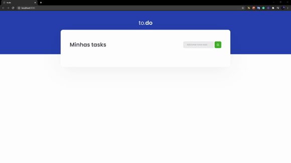

<h1 align="center">To.do</h1>
  
<h1 align="center">
  
</h1>

## About 🚀

This is the first challenge for boot camp "Ignite" of [Rocketseat](https://rocketseat.com.br/), it is a simple Todo list, to practice the basic concepts of React as React State, React Rook also Typescript.

---

## Used techs 💻

This project was developed using the following techs.

- [ReactJS](https://reactjs.org/)
- [Typescript](https://www.typescriptlang.org/)
- [Webpack](https://webpack.js.org/)
- [Babel](https://babeljs.io/)

## How to run 😉

```bash
# copy and paste on your terminal
$ git clone https://github.com/Luan4560/challege_one_ignite.git

# Open the project 
$ cd challege_one_ignite

# Install the dependencies 
$ yarn or npm install

# When the process finished:
$ yarn start

# Copy and paste on your browser
http://localhost:8080/
```
---

Developed by Luan Nasciment and provides for [Rocketseat](https://rocketseat.com.br/). 🤘